<div align="center">


<br/>

<!-- ═══════════════ QUICK BADGES & CONTACT ═══════════════ -->
<a href="mailto:amaljerry02@gmail.com"></a>
<a href="https://drive.google.com/file/d/1Bf3Mt7ttya8RY8mhi9LxjjxCTjSImDhD/view?usp=sharing"></a>
<a href="https://www.linkedin.com/in/amal-jerry-b987bb21b/"></a>
<a href="mailto:amaljerry02@gmail.com"></a>


<br/><br/>

### **AI & Distributed Systems Backend Engineer**
Specializing in **production-grade async microservices**, **autonomous LLM / multi-agent systems**, and **low-latency DSP pipelines**.<br/>
Focused on building resilient, high-throughput software that bridges deep engineering research with battle-tested production execution.

</div>

<br/>

<!-- ═══════════════ CORE FOCUS ═══════════════ -->
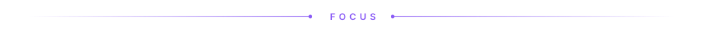

<div align="center">
  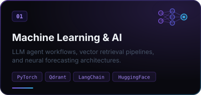
  
  
</div>

<br/>

<!-- ═══════════════ FEATURED PROJECTS GRID ═══════════════ -->
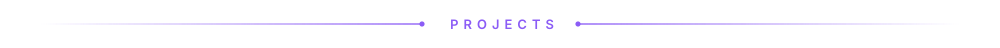

<div align="center">
  <a href="#1-ai-race-strategist--telemetry-engine"></a>
  <a href="#2-enterprise-microservices-platform"></a>
  <br/>
  <a href="#3-biometric-engine--iot-hardware-sync"></a>
  <a href="https://github.com/strangeleo02/Acoustik"></a>
</div>

<br/>

<!-- ═══════════════ ARCHITECTURAL DEEP DIVES ═══════════════ -->

### 🚀 **Engineered Systems & Architectural Highlights**

<table>
<tr>
<td width="50%" valign="top">

#### **1. [AI Race Strategist & Telemetry Engine](#)**
*Real-time telemetry ingestion, multi-agent AI race simulation & predictive pit strategy.*
- **Core Architecture**: Event-driven telemetry stream processor with multi-agent tactical debate loops.
- **Key Capabilities**: Real-time tire degradation curve modeling, time-series forecasting with TimesFM, and RAG-augmented race regulations retrieval via Qdrant vector store.
- **Stack**: `Python` · `FastAPI` · `PyTorch` · `TimesFM` · `Qdrant` · `Gemini API`

</td>
<td width="50%" valign="top">

#### **2. [Enterprise Microservices Platform](#)**
*High-throughput async backend infrastructure with multi-tenant RBAC and sub-20ms p95 latency.*
- **Core Architecture**: Async FastAPI services decoupled via Redis message broker, backed by normalized PostgreSQL schemas.
- **Key Capabilities**: Granular role-based access control (RBAC), automatic schema validation via Pydantic v2, and resilient connection pooling.
- **Stack**: `FastAPI` · `PostgreSQL` · `Redis` · `Docker` · `Pydantic` · `GCP`

</td>
</tr>
<tr>
<td width="50%" valign="top">

#### **3. [Biometric Engine & IoT Hardware Sync](#)**
*High-concurrency biometric attendance engine and edge hardware synchronization.*
- **Core Architecture**: Real-time WebSocket daemon handling simultaneous terminal telemetry and transaction queuing.
- **Key Capabilities**: Zero-trust multi-tenant isolation, automated audit logging, edge offline synchronization, and race-condition prevention.
- **Stack**: `Python` · `FastAPI` · `WebSockets` · `PostgreSQL` · `Redis` · `Linux`

</td>
<td width="50%" valign="top">

#### **4. [Acoustik — 3D Spatial Audio Engine](https://github.com/strangeleo02/Acoustik)**
*Cross-platform binaural 3D audio rendering engine for interactive spatial soundscapes.*
- **Core Architecture**: Custom DSP pipeline utilizing Head-Related Transfer Functions (HRTF) for accurate positional acoustics.
- **Key Capabilities**: Real-time 3D coordinate vector calculations, low-latency audio buffer processing, and 60 FPS interactive visualizer.
- **Stack**: `Flutter` · `Dart` · `C++ / DSP` · `Spatial Audio` · `Mobile Engine`

</td>
</tr>
</table>

<br/>

<!-- ═══════════════ TECH STACK ═══════════════ -->
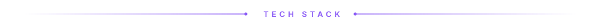

<div align="center">

| Domain | Technologies & Frameworks |
| :--- | :--- |
| **Backend & Distributed Systems** | `Python` `FastAPI` `PostgreSQL` `Redis` `Docker` `Node.js` `Linux` `WebSockets` `REST` `Celery` |
| **AI / Machine Learning & Agents** | `PyTorch` `Qdrant (Vector DB)` `Gemini API` `TimesFM` `LangChain` `HuggingFace` `RAG Architectures` |
| **Systems, DSP & Mobile** | `Rust` `C++` `Dart` `Flutter` `Spatial Audio DSP` `HRTF Rendering` `Bash` |
| **Frontend & Visualization** | `TypeScript` `JavaScript` `Next.js` `React` `Three.js` `TailwindCSS` |
| **DevOps, Cloud & Practices** | `GCP (Google Cloud)` `Docker` `Git` `GitHub Actions` `CI/CD` `TDD` `Microservices Architecture` |

<br/>

<sub><b>VISUAL TECH MATRIX</b></sub><br/>

<br/>


</div>

<br/>

<!-- ═══════════════ HOW I BUILD ═══════════════ -->

### ⚙️ **Engineering Principles & Production Standards**

```
┌───────────────────────────┐     ┌───────────────────────────┐     ┌───────────────────────────┐
│     PERFORMANCE FIRST     │     │    RESILIENT & TYPED      │     │      APPLIED AI & RAG     │
├───────────────────────────┤     ├───────────────────────────┤     ├───────────────────────────┤
│ • Sub-50ms API budgets    │     │ • Strict type safety      │     │ • Grounded multi-agent RAG│
│ • Redis caching layers    │     │ • Atomic DB transactions  │     │ • Vector indexing (Qdrant)│
│ • Async non-blocking I/O  │     │ • Automated CI/CD & tests │     │ • Production guardrails   │
└───────────────────────────┘     └───────────────────────────┘     └───────────────────────────┘
```

<br/>

<!-- ═══════════════ ACTIVITY & STREAKS ═══════════════ -->
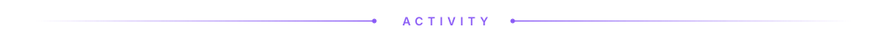

<div align="center">

<a href="https://github.com/strangeleo02">
  
</a>

<br/><br/>

<picture>
  <source media="(prefers-color-scheme: dark)" srcset="https://raw.githubusercontent.com/strangeleo02/strangeleo02/output/github-contribution-grid-snake-dark.svg">
  <source media="(prefers-color-scheme: light)" srcset="https://raw.githubusercontent.com/strangeleo02/strangeleo02/output/github-contribution-grid-snake.svg">
  
</picture>

</div>

<br/>

<!-- ═══════════════ FOOTER & GET IN TOUCH ═══════════════ -->
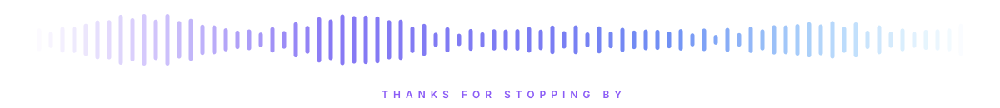

<div align="center">

### 🤝 **Let's Build Something High-Impact**
I am actively open to **full-time engineering roles** and high-scale technical challenges in **AI Engineering**, **Distributed Backend Systems**, and **Applied Machine Learning**.

<a href="mailto:amaljerry02@gmail.com"></a>
<a href="https://www.linkedin.com/in/amal-jerry-b987bb21b/"></a>
<a href="https://drive.google.com/file/d/1Bf3Mt7ttya8RY8mhi9LxjjxCTjSImDhD/view?usp=sharing"></a>

<br/>

<sub>Crafted with focus & precision by <a href="https://github.com/strangeleo02"><b>Amal Jerry</b></a></sub>

</div>

